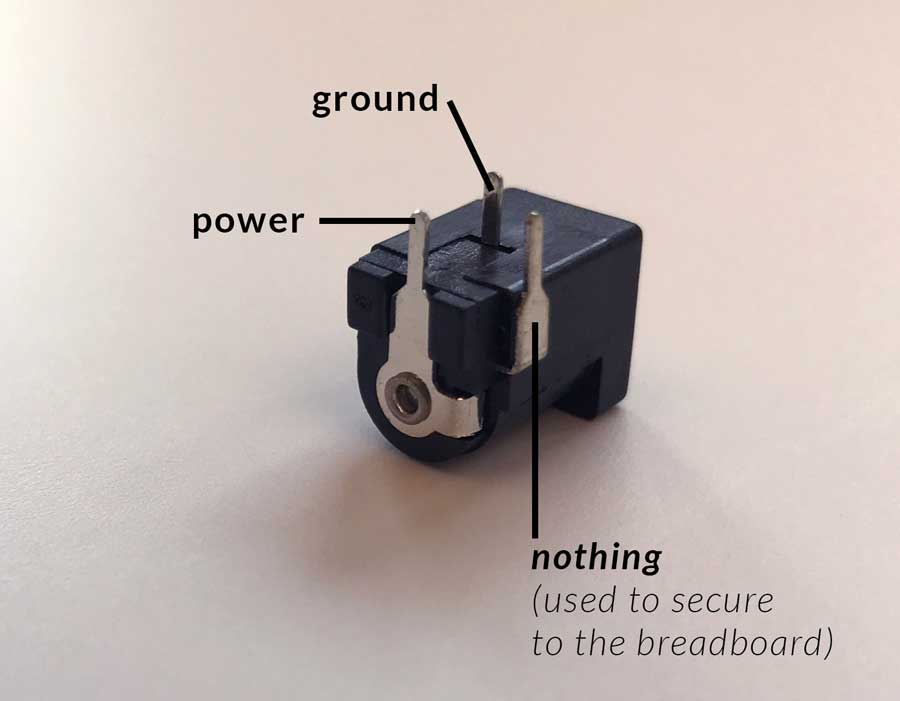

Using a breadboard, build a circuit that uses a switch to light an LED (or a few!). Construct a creative enclosure for your hardware.

#### Tasks:

1. Set up your [Online Journal](/journal/) and email me the link
2. Light an LED (or a few!) using a switch and a battery on a breadboard
3. Build a **creative enclosure** for your LED circuit (I highly suggest using cardboard...)
4. Document what you made and post it to your blog *(see below)*

#### Lab 1 Resources:

+ Sparkfun's [how to use a breadboard](https://learn.sparkfun.com/tutorials/how-to-use-a-breadboard) and ITP's [setting up a breadboard](https://itp.nyu.edu/physcomp/labs/labs-electronics/breadboard/)
+ [ITP's Electronics Lab](https://itp.nyu.edu/physcomp/labs/labs-electronics/electronics/) - scroll down to the 'basic LED circuit' section
+ [LED Current](https://vimeo.com/album/2801639/video/78674965)
+ [What is a Voltage Regulator](https://itp.nyu.edu/physcomp/labs/labs-electronics/components/)

#### For this lab you will need the following parts:

+ Solderless Breadboard and hookup wire
+ 7805 Voltage Regulator
+ An LED
+ A switch
+ Resistor (~220ohm)
+ Battery or Power Supply (and a way to connect this to your breadboard)

Here's the pinout for the barrel jack connector:

#### Blog Response:

+ Post a short written description of what you created in this Lab and post *clear* photos of both the process and the final result
+ Briefly describe your goals for this class

#### Lab 1 is due before class on January 24th

Submit a link to your blog post on Edmodo. 