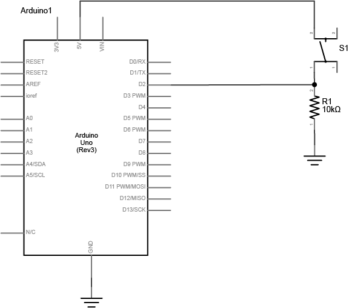
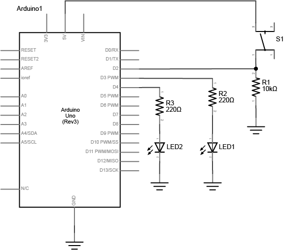

In this lab you will get set up with your Arduino prototyping environment and explore digital inputs and outputs using a microcontroller.

**Lab Objectives:**

+ Get set up with the Arduino environment
+ Build a circuit with one digital input (a switch) and two digital outputs (LEDs)
+ Program the Arduino to power the LEDs based on the switch state

**Lab 4 Resources:**

+ Videos on [Digital Input](https://vimeo.com/86548673) and [Digital Output](https://vimeo.com/86534049)
+ Notes on [Microcontroller Digital In and Out](https://itp.nyu.edu/physcomp/lessons/microcontrollers/digital-input-output/)

**Parts:**

+ Solderless Breadboard and hookup wire
+ Arduino microcontroller module & USB connector
+ LEDs of different colors (at least 2)
+ 220 ohm and 10 Kilohm resistors
+ Switch or pushbutton

**Digital Input and Output Lab:**

On a breadboard, setup a **Digital Input** (a switch) - Connect a switch to digital input 2 on the Arduino. The switch shown below is a store-bought momentary pushbutton, but you can use any switch (or build your own!). 

 

  

The resistor connecting the switch is a ***pulldown resistor***. It provides the digital input pin with a reference to ground. Without it, the input will behave unreliably.

If you don’t have a 10-kilohm resistor for the switch, you can use any reasonably high value. 4.7K, 22K, and even 1 Megaohm resistors have all been tested with this circuit and they work fine.

Add **Digital Outputs** (LEDs) - Connect a 220-ohm resistor and an LED in series to digital pin 3 and another to digital pin 4 of the Arduino.

 

  

*Note on LED Resistor Values* - For the resistor on the LED, the higher the resistor value, the dimmer your LED will be. So 220-ohm resistors give you a nice bright LED, 1-kilohm will make it dimmer, and 10K or higher will likely make it too dim to see.

**Program the Arduino** - Connect the microcontroller to your computer via USB. 

Select your board - choose *Tools > Board* then select *Arduino/Genuino Uno*

Select your port - When you plug the Arduino into your computer, you’ll find a new serial port in the *Tools > Serial Port* menu (for details on installing the software, and USB-to-serial drivers for older Arduino models, see the [Arduino Getting Started Guide](https://www.arduino.cc/en/Guide/HomePage)). In OSX, the name will begin with */dev/tty.usbmodem-* if it’s an Arduino Uno later, and */dev/tty.usbserial-* if it’s a Duemilanove or earlier. In Windows it will start with *COM* like all the other serial ports.

Write a program that reads the digital input on pin 2. When the switch is pressed, turn the yellow LED on and the red one off. When the switch is released, turn the red LED on and the yellow LED off.

Hint: use the following functions in your program:
[`pinMode()`](https://www.arduino.cc/en/Reference/PinMode)
[`digitalRead()`](https://www.arduino.cc/en/Reference/DigitalRead)
[`digitalWrite()`](https://www.arduino.cc/en/Reference/DigitalWrite)

***Lab 4 is due before class on Thursday February 9th***

Your blog response should include a *clear* video of your working circuit and a brief description of what you made. Submit a link to your blog post on Edmodo. 