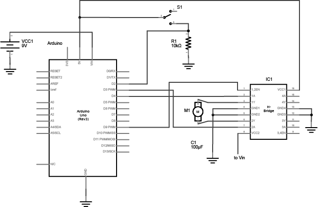
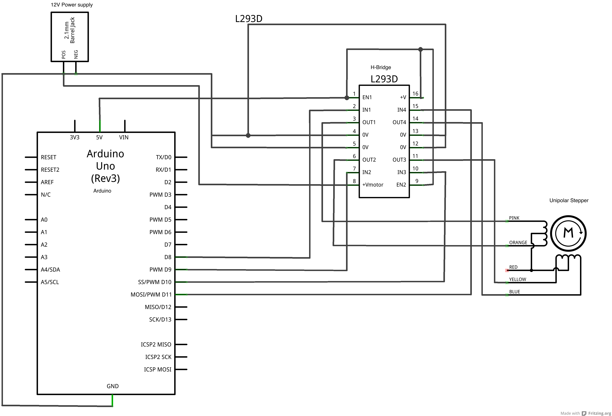
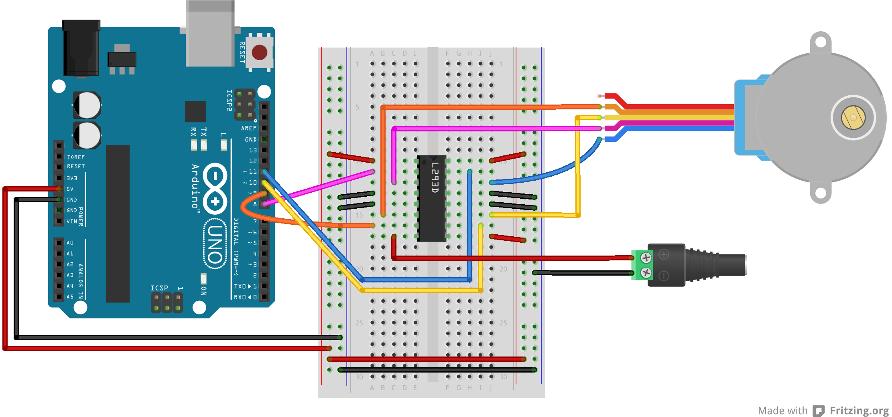

Get familiar using motors with Arduino. In this lab you will explore DC motors and Stepper motors, driving them using an H-Bridge. 

**Lab Objectives:**

+ Use an H-Bridge to drive a DC motor
+ Use an H-Bridge to drive a Stepper motor 

**Lab 6 Resources:**
 
+ [Tom Igoe's Notes on Steppers](http://www.tigoe.net/pcomp/code/circuits/motors/stepper-motors/)
+ [DC Motors: The Basics](https://itp.nyu.edu/physcomp/lessons/dc-motors/dc-motors-the-basics/)
+ [Controlling Stepper Motors](https://itp.nyu.edu/physcomp/lessons/dc-motors/stepper-motors/)
+ [Meet the Motors (video)](https://vimeo.com/84274150)
+ [H-Bridges (video)](https://vimeo.com/100357623)
+ [All About Steppers (video)](https://vimeo.com/101362995)
+ [Controlling a Unipolar Stepper Motor (video)](https://vimeo.com/102030557)

### Part 1: DC Motor

In this first part of the lab, you’ll learn how to drive a DC motor using an H-Bridge and change direction using a button. 

To reverse a DC motor, you need to be able to reverse the direction of the current in the motor. The easiest way to do this is using an H-bridge circuit. 

**Supplies for Part 1**

+ Solderless Breadboard and hookup wire
+ Arduino microcontroller module & USB connector
+ Switch
+ 10Kohm resistors
+ H-Bridge
+ DC Motor
+ 9V Power Supply (or battery - although the motor will drain a battery *fast*)

**Setup the Circuit**

First, add a Digital Input (a switch) - connect this switch to digital input 2 on the Arduino. Next, wire the H-Bridge and the DC motor. Lastly, add an external power supply to drive the motor - you will power the H-bridge from the VIN pin on your Arduino.

 

  

**How your H-bridge works**

The L293NE/SN754410 is a very basic H-bridge. It has two bridges, one on the left side of the chip and one on the right, and can control 2 motors. It can drive up to 1 amp of current, and operate between 4.5V and 36V. The small DC motor you are using in this lab can run safely off a low voltage so this H-bridge will work just fine.

The H-bridge has the following pins and features:

+ Pin 1 (1,2EN) enables and disables our motor whether it is give HIGH or LOW
+ Pin 2 (1A) is a logic pin for our motor (input is either HIGH or LOW)
+ Pin 3 (1Y) is for one of the motor terminals
+ Pin 4-5 are for ground
+ Pin 6 (2Y) is for the other motor terminal
+ Pin 7 (2A) is a logic pin for our motor (input is either HIGH or LOW)
+ Pin 8 (VCC2) is the power supply for our motor, this should be given the rated voltage of your motor
+ Pin 9-11 are unconnected as you are only using one motor in this lab
+ Pin 12-13 are for ground
+ Pin 14-15 are unconnected
+ Pin 16 (VCC1) is connected to 5V

 

  

If your motor can run on 5V and less than 500mA, you can use the Arduino’s 5V output, otherwise you will need to use an external power supply. **Most motors require a higher voltage and higher current draw than this, so you will need an external power supply.**

***Safety Warning:*** Running a motor at a voltage much lower or much higher than what it’s rated for could potentially damage or permanently destroy your motor. When the motor doesn’t spin, the voltage is too low. When the motor runs hot, or sounds like it’s straining, the voltage is too high.

**Program the Microcontroller**

First set up constants for the switch pin, the two H-bridge pins, and the enable pin of the H-bridge. Use one of the analogWrite pins (3,5,6,9,10, or 11) for the enable pin.

<pre>
const int switchPin = 2;    // switch input
const int motor1Pin = 3;    // H-bridge leg 1 (pin 2, 1A)
const int motor2Pin = 4;    // H-bridge leg 2 (pin 7, 2A)
const int enablePin = 9;    // H-bridge enable pin
</pre>

In the `setup()`, set all the pins for the H-bridge as outputs, and the pin for the switch as an input. Then set the enable pin high so the H-bridge can turn the motor on.

<pre>
void setup() {
    // set the switch as an input:
 
    // set all the other pins you're using as outputs:
 
    // set enablePin high so that motor can turn on:

}
</pre>

In the main loop() read the switch. If it’s high, turn the motor one way by taking one H-bridge pin high and the other low. If the switch is low, reverse the direction by reversing the states of the two H-bridge pins.

<pre>
void loop() {
    // if the switch is high, motor will turn on one direction
 
    	// set leg 1 of the H-bridge low
	// set leg 2 of the H-bridge high  
    
    // else (which means the switch is low), motor will turn in the other direction

    	// set leg 1 of the H-bridge high
	// set leg 2 of the H-bridge low
}
</pre>

Once you’ve seen this code working, try modifying the speed of the motor using the analogWrite() function, as explained in the Analog Lab. Use analogWrite() on the enable pin of the motor, and see what happens as you change the value of the analogWrite().

### Part 2: Stepper Motors

Stepper motors are motors that have multiple coils in them, so that they can be moved in small increments or steps. Stepper motors are typically either unipolar or bipolar, meaning that they have either one main power connection or two. Whether a stepper is unipolar or bipolar, however, you can control it with an H-bridge. This lab shows you how to set up a unipolar stepper motor using an H-Bridge. You can use the same control circuit with a bipolar motor too, however.

**Supplies for Part 2**

+ Solderless Breadboard and hookup wire
+ Arduino microcontroller module & USB connector
+ H-Bridge
+ Stepper Motor (unipolar)
+ 9V or 12V Power Supply

**Setup the Circuit**

 

  

**Program the Microcontroller**

Program the microcontroller to run the stepper motor through the H-bridge using the stepper library. 

Make the stepper move one whole revolution at a time. The number of steps per revolution will depend on your individual stepper, so check the data sheet for the number of steps per revolution:

Use the [Arduino Stepper Library](https://www.arduino.cc/en/reference/stepper) as a reference. Also, there is helpful code on [this stepper revolution example](https://www.arduino.cc/en/Tutorial/StepperOneRevolution). 

***Lab 7 is due by end of day Friday 3/24***  
*Ideally you'll finish the lab in class, just be sure to submit the lab before you leave for Spring Break!*

Your blog response should include a schematics of both circuits, a *clear* video of your working circuits (for both part 1 and part 2) and a brief description of what the circuit does and how you made it. Submit a link to your blog post on Edmodo.
